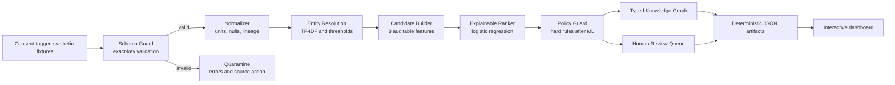

# TerraGraph AI


**Evidence-aware opportunity intelligence for a more connected food system.**

I built TerraGraph AI as an independent technical demonstration of how fragmented food and agriculture listings can become validated records, resolved entities, typed graph relationships, and explainable supply-demand candidates—without allowing a model to make commercial decisions.

> **Demo boundary:** every organization, listing, transaction scenario, source reference, evidence reference, and coordinate in this repository is fictional synthetic data. This project is not affiliated with, endorsed by, or built from proprietary data belonging to The Ryzosphere or any other company.

## What it demonstrates

- Strict, versioned ingestion that quarantines malformed rows instead of silently coercing them.
- Unit and price normalization to kilograms and USD/kg while preserving raw values, nulls, source references, and field-level lineage.
- Conservative product and organization entity resolution using TF-IDF similarity plus explicit thresholds and contextual constraints.
- An explainable scikit-learn ranker that scores same-product supply-demand candidates across eight documented features.
- Deterministic post-model guardrails for certification assertions, missing evidence, commercial completeness, availability, and mandatory human review.
- A typed knowledge graph connecting organizations, products, regions, processor capabilities, certification assertions, and candidate opportunities.
- An interactive React dashboard with filters, model drivers, hard-check results, provenance, a review queue, and a replayable audit trace.

## Demo snapshot

These values are generated from the checked-in synthetic snapshot by `python -m pipeline.run`; they are not hand-entered dashboard claims.

| Area | Current result |
| --- | ---: |
| Raw records scanned | 25 |
| Validated / quarantined | 23 / 2 |
| Supply / demand listings | 11 / 12 |
| Resolved organizations / canonical products | 21 / 10 |
| Conservative organization alias merges | 2 |
| Candidate opportunities | 13 |
| Review-ready / needs evidence / blocked | 10 / 2 / 1 |
| Knowledge-graph nodes / edges | 60 / 88 |
| Guardrail evaluations | 65 |
| Automatic commercial actions | **0** |

### Model fixture metrics

The ranker is `StandardScaler + LogisticRegression`, trained on 48 manually curated synthetic review scenarios (24 positive, 24 negative) using eight features. Six-fold stratified out-of-fold evaluation on that fixture reports:

| Metric | Result |
| --- | ---: |
| ROC-AUC | 0.983 |
| Average precision | 0.979 |
| F1 at 0.5 | 0.936 |

Those numbers describe only a tiny synthetic fixture. They do **not** establish real-world accuracy, calibration, transaction probability, or production readiness. The dashboard therefore labels every `fitScore` as a relative ranking signal.

## Architecture



The UI presents the stages as an agent workflow because each module has a bounded responsibility, input/output counts, and an audit receipt. Runtime execution is deliberately deterministic and offline: it does not call an LLM, scrape the web, query a live registry, contact an organization, or initiate a transaction.

## AI/ML choices

### 1. Entity resolution

- Product names first use normalized exact aliases, then character 3–5-gram TF-IDF similarity against a small taxonomy.
- A score below `0.58` is routed to manual review rather than accepted.
- Organization aliases use character 2–4-gram TF-IDF with a `0.72` threshold and can merge only when city/state and market side also agree.
- Raw values, canonical values, resolution methods, scores, and decisions remain together in the audit artifact.

### 2. Opportunity ranking

Candidate generation is restricted to accepted records that resolve to the same canonical product. Logistic regression ranks each pair using:

1. product-language similarity;
2. canonical product agreement;
3. geographic proximity;
4. requested-volume coverage;
5. buyer ceiling versus supplier ask;
6. certification evidence fit;
7. availability-window overlap; and
8. derived evidence quality.

The dashboard shows the four strongest standardized feature contributions for the selected candidate. The score helps order a review queue; it cannot approve a match.

### 3. Why interpretable ML here

The data is small, the decisions are trust-sensitive, and the goal is to make reasoning inspectable. TF-IDF and logistic regression provide useful fuzzy matching and prioritization without inventing missing facts. They also make it straightforward to test thresholds, expose feature values, and keep the demo reproducible.

## Deterministic guardrails

The model runs **before** the policy layer, and its score cannot override these controls:

| Control | Deterministic behavior |
| --- | --- |
| `GR-001` | Block when a buyer-required certification is not asserted by the supplier. |
| `GR-002` | Route to evidence review when the assertion lacks an evidence reference. |
| `GR-003` | Route to commercial review when either price is unknown; never infer a quote. |
| `GR-004` | Block when the stated availability windows do not overlap. |
| `GR-005` | Require human approval before outreach or any commercial action. |

Additional trust boundaries:

- Unknown schema fields and invalid types are quarantined, not dropped or converted.
- Certification text remains a source assertion; no demo certificate is labeled real-world verified.
- Every accepted raw record and input file receives a SHA-256 reference.
- Canonical quantities and prices retain source fields and transformation lineage.
- Fixed input data, timestamps, thresholds, ordering, and random seeds make identical runs reproducible when dependency versions match.

## Quick start

### Prerequisites

- Python 3.14.2 for exact artifact reproduction (recorded in `.python-version`; pinned dependencies require Python 3.11+)
- Node.js 22.13+

### Generate the data and ML artifacts

```bash
cd TerraGraph-AI
python3 -m venv .venv
source .venv/bin/activate
python -m pip install -r requirements.txt
python -m pipeline.run
```

The last command regenerates the normalized records, audits, model report, graph, run manifest, quarantine output, and dashboard JSON.

### Run the dashboard

```bash
npm ci
npm run dev
```

Open the local URL printed in the terminal.

### Verify the project

```bash
python tests/test_pipeline.py
npm test
npm run lint
npm run typecheck
```

## What to inspect in the dashboard

1. **Command center:** snapshot metrics and the selected candidate's decision state.
2. **Opportunities:** status/product/score filters, ranked candidates, feature drivers, source references, and hard checks.
3. **Knowledge graph:** a truthful selected-path projection plus provenance-aware dataset totals.
4. **Agent trace:** nine deterministic stages with input/output counts and a run hash.
5. **Review queue:** quarantined rows, alias merges, missing fields, and unverified assertions become visible tasks.
6. **Model card:** intended use, fixture metrics, score semantics, and limitations.

## Project structure

```text
TerraGraph-AI/
├── app/                         # Interactive React dashboard and checked-in data snapshot
├── data/
│   ├── raw/                     # Synthetic source listings
│   ├── reference/               # Taxonomy, demo evidence, synthetic review history
│   └── processed/               # Reproducible pipeline artifacts and audit records
├── pipeline/
│   ├── models.py                # Strict versioned input contract
│   ├── ingest.py                # Validation, quarantine, hashes
│   ├── normalize.py             # Units, evidence assertions, field lineage
│   ├── entity_resolution.py     # Product and organization resolution
│   ├── ranker.py                # Features, model training, explanations
│   ├── guardrails.py            # Deterministic post-model controls
│   ├── graph.py                 # Typed knowledge-graph construction
│   ├── quality.py               # Actionable data-quality findings
│   └── run.py                   # End-to-end orchestration and publishing
├── public/data/dashboard.json   # Dashboard-ready generated contract
├── tests/                       # Pipeline behavior and rendered-app checks
└── docs/                        # Walkthrough and submission-ready written drafts
```

## Generated artifacts

| Artifact | Purpose |
| --- | --- |
| `data/processed/normalized_records.json` | Canonical fields, source assertions, and field lineage. |
| `data/processed/entity_resolution_audit.json` | Raw-to-canonical mappings and conservative alias merges. |
| `data/processed/model_report.json` | Features, coefficients, fixture metrics, and score disclosure. |
| `data/processed/knowledge_graph.json` | Typed nodes and provenance-aware relationships. |
| `data/processed/agent_audit_log.json` | Stage operations, counts, decisions, and execution mode. |
| `data/processed/quarantine.json` | Rejected rows and exact validation failures. |
| `data/processed/run_manifest.json` | Run ID plus hashes for the input and reference fixtures. |

## Test coverage

The automated suite checks the behavior that matters most for a trustworthy workflow:

- malformed and schema-drifted rows are quarantined;
- duplicate record IDs and non-finite numbers are rejected before scoring;
- availability dates and capture timestamps obey downstream-safe contracts;
- valid null prices remain null;
- raw and canonical entity values both survive resolution;
- organization merges require contextual evidence;
- the real scikit-learn model reports out-of-fold fixture metrics;
- scores are bounded and never presented as probabilities;
- missing certification assertions trigger a hard block;
- certification assertions are never described as verified facts;
- graph capability edges retain evidence references;
- canonical fields retain provenance; and
- a second pipeline run exactly matches both checked-in dashboard contracts.

## Limitations

- All inputs, labels, organizations, evidence references, and coordinates are synthetic.
- Forty-eight curated scenarios are enough to exercise code paths, not to establish external validity.
- No live data connector, certification registry, graph database, or transactional system is integrated.
- Distance is a straight-line feature between fictional coordinates, not a route or freight quote.
- Perishability, capacity, counterparty risk, contracting terms, and commercial impact are not modeled.
- The ranker is not calibrated and has no fairness, drift, or independent domain-expert validation.
- The dashboard is a static single-user demonstration rather than a production access-controlled application.

## Sensible production next steps

1. Add permissioned connectors with connector-specific schemas, rate limits, consent, and deletion handling.
2. Replace synthetic labels with reviewed historical outcomes and define decision-specific offline/online evaluation.
3. Connect certification claims to authoritative registries while retaining assertion-versus-verification semantics.
4. Add geocoding quality, route/freight estimates, perishability, capacity, and temporal inventory models.
5. Persist graph and review events, introduce role-based access, and monitor data quality, drift, calibration, and reviewer agreement.

## Submission materials

- [Five-minute walkthrough](docs/FIVE_MINUTE_WALKTHROUGH.md)
- [Direct project response](docs/PROJECT_RESPONSE.md)
- [Handshake reply draft](docs/HANDSHAKE_REPLY.md)
- [Email draft for David and Leigh](docs/EMAIL_TO_DAVID_AND_LEIGH.md)

Built by **Priyanshi Yadav** as an independent synthetic demonstration.
